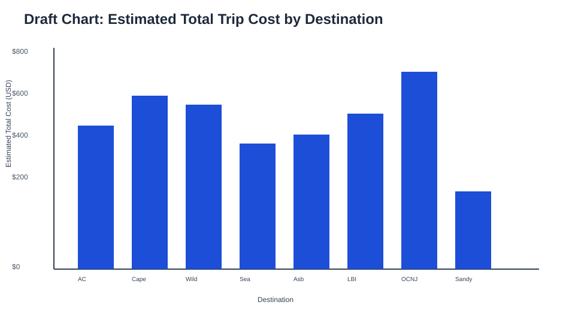

# Spring Break on a Student Budget: New Jersey Edition

## Essential Question

Which New Jersey spring break destinations are realistically affordable for college students given a fixed travel budget?

## Claim (Hypothesis)

Most popular New Jersey shore destinations exceed a typical student travel budget unless the trip is short or lodging is shared.

## Audience

College students in New Jersey planning low-cost spring break trips from the Newark area.

## STAR Draft

### Situation

- Students want spring break trips but often underestimate full trip costs.
- Lodging, food, and activities can quickly push destinations beyond a realistic budget.

### Task

- Help viewers identify which NJ destinations are affordable under different budgets and trip lengths.
- Let viewers test how sharing lodging changes affordability.

### Action

- Build a 3-view interactive React app:
  - Destination total cost comparison (bar chart)
  - Destination cost breakdown (component costs)
  - Distance vs total cost (scatter)
- Add controls for budget, trip length, and lodging share count.
- Add a destination details panel with a photo, short description, and attractions.

### Result

- Expect to show lodging as the largest cost driver for multi-day trips.
- Help viewers compare destinations and then click into each one for context beyond the cost charts.

## Dataset & Provenance

- **Source links**:
  - Booking.com (lodging baseline): https://www.booking.com/
  - Expedia (lodging baseline): https://www.expedia.com/
  - Airbnb (lodging baseline): https://www.airbnb.com/
  - NJ Transit (fare references): https://www.njtransit.com/
  - AAA mileage rates (travel assumptions): https://newsroom.aaa.com/tag/mileage-rate/
  - Project Time Off travel spending references: https://www.projecttimeoff.com/
- **Method**: Refreshed March 2026 estimates synthesized from the sources above (details in `data/notes.md`).
- **Scope**: 10 NJ destinations, round-trip costs from Newark, NJ for March 2026.
- **Retrieval date**: February 28, 2026.
- **License/usage**: Educational, non-commercial classroom use; this repo stores only student-generated estimates and not redistributed proprietary source datasets.
- **Full methodology & live API options**: See [data/notes.md](data/notes.md)

## Data Dictionary

| Column | Meaning | Units |
| --- | --- | --- |
| destination | Destination name | text |
| distance_miles | Distance from Newark, NJ | miles |
| travel_cost | Estimated round-trip travel cost | USD |
| lodging_per_night | Estimated nightly lodging cost | USD/night |
| avg_food_per_day | Estimated daily food cost | USD/day |
| activity_cost | Estimated fixed activity cost per trip | USD |
| known_for | Destination identity summary | text |
| about | Short destination description for the detail card | text |
| attractions | Top attractions at destination | list of text |
| photo_url | Source photo reference from dataset (app now prefers local images in `public/images/destinations`) | URL |

## Data Viability Audit

### Missing values + weird fields

- Missing values: none in the starter dataset.
- Weird fields: none blocking analysis; all numeric cost fields are consistent and usable.

### Cleaning plan

- Preserve original starter data in [data/raw.csv](data/raw.csv).
- Convert and store cleaned local app data in [data/processed.json](data/processed.json).
- Keep currency in USD and distance in miles.
- Compute derived values in transforms (effective lodging, total trip cost, affordability).

### What this dataset cannot prove

- It cannot provide real-time prices or booking availability.
- It cannot represent personal spending behavior or seasonal surges.
- It cannot guarantee exact trip costs for individuals.

## Draft Chart Screenshot

- This chart directly compares total estimated trip costs across destinations, which maps to the essential affordability question.
- It supports budget-based interaction by making over/under-budget destinations immediately visible.

## Cleaning & Transform Notes

- Data loads locally through [src/lib/loadData.ts](src/lib/loadData.ts).
- Types/contracts are defined in [src/lib/schema.ts](src/lib/schema.ts).
- Core calculations are pure functions in [src/lib/transforms.ts](src/lib/transforms.ts):
  - `effective_lodging_per_night = lodging_per_night / lodgingMode`
  - `nights = max(days - 1, 0)`
  - `total_trip_cost = travel_cost + (effective_lodging_per_night * nights) + (avg_food_per_day * days) + activity_cost`
  - affordability: `total_trip_cost <= budget`

## Definitions

- Affordable: total trip cost is less than or equal to selected budget.
- Lodging share count (`lodgingMode`): number of people splitting lodging (1, 2, 3, or 4).
- Nights: one fewer than trip days, minimum of zero.

## Interaction Design

- Budget slider (`$100–$1000`) updates affordability status and chart emphasis.
- Trip length selector (`1–5 days`) recalculates lodging and food portions.
- Lodging share selector (`1, 2, 3, 4`) divides lodging cost by group size.
- Destination selection (bar click or dropdown) updates the breakdown chart and the destination detail card.
- Destination detail card displays a local photo, a short destination summary, a map with coordinates, and notable attractions.

## Limits & What I’d Do Next

- Costs are estimated rather than live market rates.
- Destination list is limited to a small starter set.
- Next iteration: connect live hotel and transit APIs, add seasonal pricing, and support persona-based budgets.

## Deployment Link

https://student-reality-lab-pagdatoon-hcbcjs5i9-pdpag.vercel.app/

## Quick Run

- `npm install`
- `npm run dev:all` (recommended: frontend + API for full chatbot features)
- `npm run dev` (frontend only)
- `npm run build`

## Vercel Deployment

- Build command: `npm run build`
- Output directory: `dist`
- Required environment variable: `OPENAI_API_KEY`
- API routes for Vercel serverless are in `api/chat.js`, `api/health.js`, and `api/analytics.js`

Notes:
- `npm start` runs both frontend and local API (`dev:all`) for local development.
- For GitHub Pages style subpath deployments, set `VITE_BASE_PATH` (example: `/student-reality-lab-pagdatoon/`).

## Added Reliability Features

- Chat API hardening: request validation, rate limiting, and health endpoint (`GET /api/health`)
- Lightweight analytics endpoint (`POST /api/analytics`) for interaction telemetry
- Cost confidence bands shown in destination chart tooltips (`low`/`high` estimate range)
- Data transparency panel in the dashboard with refreshed date and methodology details

## Maintenance Scripts

- `npm run check:hotel-links` validates hotel listing links in `api/server.js`
- `npm run refresh:data-metadata` updates `displayedAsOf` in `src/lib/metadata.ts`
